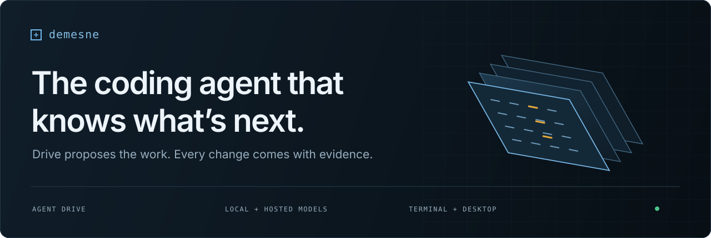

<p align="center">
  
</p>

<p align="center">
  A coding agent with a browser-rendered interface in Ghostty.<br>
  Local or hosted models. Durable work. Every change open to inspection.
</p>

<p align="center">
  <a href="https://github.com/Shingi-Michael/demesne-cli/actions/workflows/ci.yml"></a>
  <a href="LICENSE"></a>
  <a href="https://bun.sh"></a>
</p>

<p align="center">
  <a href="#desktop-app-preview"><strong>Desktop preview</strong></a> ·
  <a href="#get-started"><strong>Terminal setup</strong></a> ·
  <a href="docs/README.md"><strong>Documentation</strong></a> ·
  <a href="docs/architecture.md"><strong>Architecture</strong></a> ·
  <a href="CONTRIBUTING.md"><strong>Contribute</strong></a>
</p>

<br>

<a href="docs/assets/demesne-review.png"></a>

<p align="center"><sub>The real graphics UI, captured from terminal image tiles using an isolated, deterministic demo. <a href="docs/assets/README.md">About these captures</a>.</sub></p>

## A place to build—and understand what changed

Demesne brings the conversation, code, and evidence into one terminal workspace. A local daemon owns the work, so closing the interface doesn’t discard an active coding turn. Reopen a session to inspect its history and continue.

<table>
<tr>
<td width="50%" valign="top">
<h3>See the work</h3>
<p>Review diffs, open source files, inspect command output, and rerun checks. Recorded evidence stays attached to the turn that produced it.</p>
<a href="apps/graphics/README.md#review-panel-upgrades">Explore the panels →</a>
</td>
<td width="50%" valign="top">
<h3>Choose your model</h3>
<p>Connect a local OpenAI-compatible server, OpenRouter, or your ChatGPT account. Pick the model and supported reasoning level for the task.</p>
<a href="docs/authentication.md">Connect a provider →</a>
</td>
</tr>
<tr>
<td width="50%" valign="top">
<h3>Delegate the investigation</h3>
<p>Send independent questions to read-only subagents with separate contexts. Provider-specific queues match concurrency to your server’s capacity.</p>
<a href="docs/subagents.md">Meet the subagents →</a>
</td>
<td width="50%" valign="top">
<h3>Give Drive a mission</h3>
<p>Choose evidence-linked next steps, or set a mission. Drive coordinates coding turns, checks results, and remembers completed work and project preferences.</p>
<a href="docs/agent-drive.md">How Drive works →</a>
</td>
</tr>
</table>

## Desktop app (preview)

Demesne can also run in its own **Tauri 2 desktop window**, using the same conversation, review panels, provider setup, and Drive. The desktop frontend uses the system webview; it does not launch Electron or send pixels through the terminal. The CLI and Ghostty interface remain available.

From a source checkout with [Rust and platform prerequisites](docs/desktop.md#prerequisites) installed:

```sh
bun install --frozen-lockfile
bun run desktop
```

Choose your project in the native folder picker, then connect a provider using setup. To build an application bundle, run `bun run build:desktop`.

This is a development preview. macOS and Ubuntu 22.04/24.04 are the initial desktop targets; Ubuntu 20.04 remains covered by the terminal interface. Desktop builds are not yet signed/notarized releases, and automatic updates are not implemented. [Desktop setup, packaging, and verification →](docs/desktop.md)

## Get started

**You’ll need [Bun 1.4.0](https://bun.sh), [Ghostty](https://ghostty.org), and a model connection.** The graphics interface uses Electron/Chromium and Kitty graphics; the plain CLI supports headless workflows. Published release builds target macOS. **On Linux? [Jump to the Linux quick start and sandbox repair](#linux-quick-start).**

```sh
git clone https://github.com/Shingi-Michael/demesne-cli.git
cd demesne-cli
bun install --frozen-lockfile
bun run build
bun run build:graphics

./dist/demesne setup
./dist/demesne daemon start
./dist/demesne
```

Setup walks through the provider, model, and configuration. Choose a local server, **Continue with ChatGPT**, OpenRouter, or a custom endpoint. [Provider and account guide →](docs/authentication.md)

<details>
<summary><strong>Installation details and working in another project</strong></summary>

Both builds are required for the graphics interface. Keep `dist/graphics` and `dist/node_modules` beside the CLI and daemon:

```text
dist/
├── demesne
├── demesned
├── graphics/
└── node_modules/
```

Link the binaries into an existing directory on your PATH, then open your project:

```sh
ln -sf "$PWD/dist/demesne" "$PWD/dist/demesned" /usr/local/bin/
cd /path/to/project
demesne
```

For source development, use `bun run graphics:setup` and `bun run demesne`. [Graphics setup and packaging](apps/graphics/README.md) covers the details; [troubleshooting](docs/troubleshooting.md) covers older running processes and terminal capabilities. Rebuilds don’t replace a running daemon or UI.

</details>

### Linux quick start

From the cloned repository, run these commands as your **normal user inside Ghostty** in a desktop session:

```sh
bun install --frozen-lockfile
bun run demesne setup
bun run demesne daemon start
bun run graphics
```

No compiled build is needed for this source workflow. `bun run graphics` downloads a missing Electron runtime and checks that a sandboxed renderer can start before opening the UI.

**Seeing “The SUID sandbox helper binary was found, but is not configured correctly”?** Run this explicit repair, then launch again:

```sh
bun run graphics:setup --install-sandbox
bun run graphics
```

The repair requests administrator access **only for the sandbox helper**; the app stays unprivileged and sandboxing stays enabled.

Ubuntu 20.04 and 24.04 are checked in CI using virtual X11 displays and software rendering. See the [Linux guide](docs/linux.md) for system libraries, packaged installations, and the limits of that coverage.

## From an idea to a verified change

```text
Explain how session restore works, with file references.
```

Explore first, then ask for a focused change. Inspect the result beside the conversation, or delegate a bounded mission:

```text
/drive --bounded Fix the failing parser tests and verify the change
```

Plain `/drive <mission>` is continuous; `--bounded` stops after one verified task. NEXT’s **Run** action starts a bounded mission. Drive’s coding turns run with every tool allowed, so edits and commands don’t wait for you; pushing, pull requests, releases and package publishes still ask. [Mission controls and limits →](docs/agent-drive.md)

<details>
<summary><strong>See the start screen and Drive’s NEXT queue</strong></summary>

### Start with a question or a suggested next step


### Decide what runs next


These are demo scenarios rendered by the application, not live-model performance benchmarks.

</details>

## Stay in control

| Do this | Use this |
| --- | --- |
| Send a message / add a line | Enter / Shift+Enter |
| Open settings | Tab on an empty composer, or Ctrl+K |
| Inspect changes / files / checks | Alt+D / Alt+O / Alt+T |
| Open Drive / history | Alt+J / Alt+H |
| Return to live output | Ctrl+G |
| Stop work | Ctrl+C, or double Esc after closing menus/panels |
| Close the UI | Ctrl+Q; daemon-owned work continues |

[All commands and keyboard shortcuts →](docs/cli-reference.md)

Writes and host commands require approval unless a matching grant applies. **Commands run as your OS user, not in a sandbox.** Subagents are read-only. Drive’s own coding turns are pre-approved (except publishing), so a Drive mission can run any command your account can. [Security boundaries →](SECURITY.md)

## Also at home in a script

```sh
demesne prompt --output json "Explain the test layout"
echo "Summarize this failure" | demesne prompt --output stream-json
demesne ps --json
```

Use text, JSON, or streamed events. Non-interactive approval requests are denied rather than left waiting. [Headless usage →](docs/cli-reference.md#headless-output)

## Go deeper

| | |
| --- | --- |
| [Documentation index](docs/README.md) | Every guide in one place |
| [Configuration](docs/configuration.md) | Providers, context budgets, slots, and environment variables |
| [Architecture](docs/architecture.md) | Processes, APIs, storage, and request flows |
| [Image preview](docs/artifact-preview-plan.md) | Artifacts, references, zoom, and model vision |
| [Troubleshooting](docs/troubleshooting.md) | Startup, auth, rendering, and slow inference |
| [Contributing](CONTRIBUTING.md) | Development setup and verification |

---

<p align="center">
  Built by <a href="https://github.com/Shingi-Michael">Shingirayi Kamucheka</a> ·
  <a href="LICENSE">MIT licensed</a> ·
  <a href="CHANGELOG.md">Changelog</a> ·
  <a href="https://github.com/Shingi-Michael/demesne-cli/issues">Issues &amp; ideas</a>
</p>
