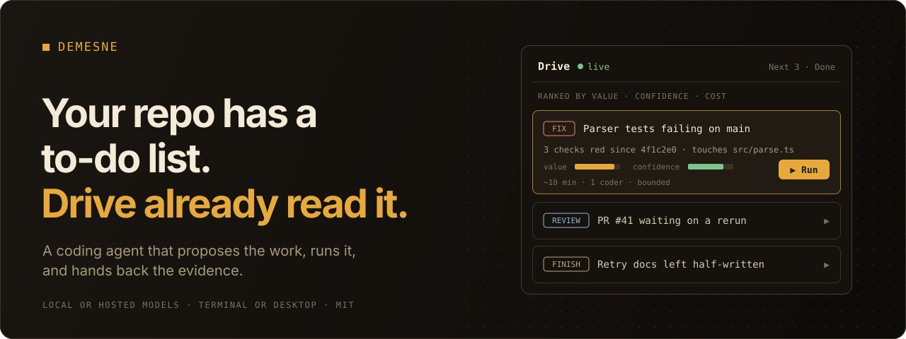
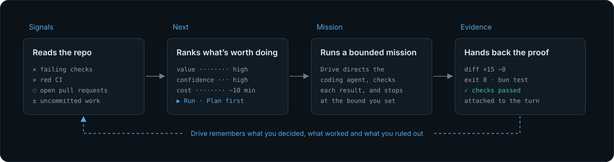
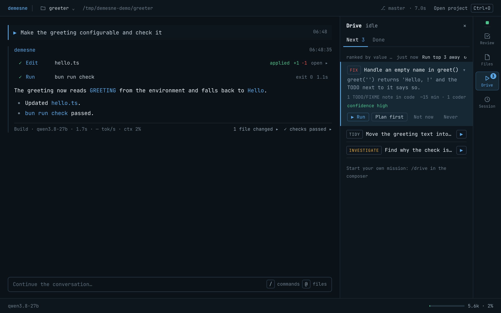
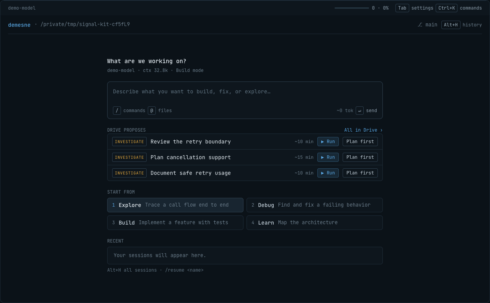
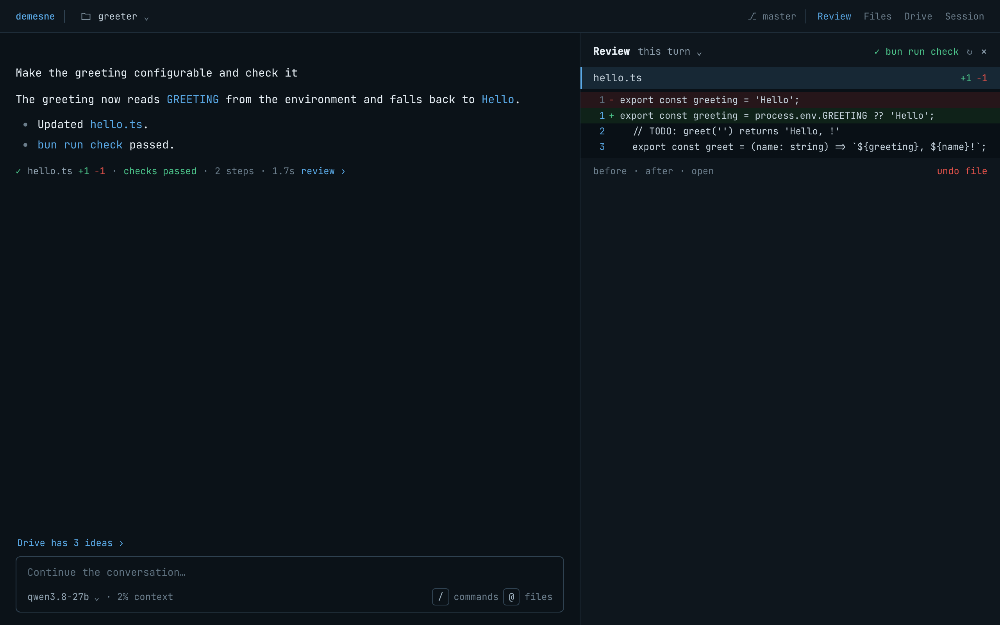

<p align="center">
  
</p>

<p align="center">
  <a href="https://github.com/Shingi-Michael/demesne-cli/actions/workflows/ci.yml"></a>
  <a href="LICENSE"></a>
  <a href="https://bun.sh"></a>
</p>

<p align="center">
  <a href="#try-it">Try it</a> &nbsp;·&nbsp;
  <a href="#how-drive-works">How Drive works</a> &nbsp;·&nbsp;
  <a href="#see-it">See it</a> &nbsp;·&nbsp;
  <a href="#install">Install</a> &nbsp;·&nbsp;
  <a href="docs/README.md">Docs</a>
</p>

demesne is a coding agent that starts by reading your project. Its **Drive** looks at failing checks, red CI, open pull requests and work you left unfinished, then suggests what to do next. Press **Run** and Drive gives the coding agent a bounded task, checks the result and shows you the diff, the commands it ran and whether the checks passed. It remembers what you decided, so it won't suggest the same thing twice.

## Try it

```sh
git clone https://github.com/Shingi-Michael/demesne-cli.git && cd demesne-cli
bun install --frozen-lockfile
bun run desktop
```

Choose a project, connect a model and open **Drive**. You need [Bun 1.4](https://bun.sh), plus [Rust](docs/desktop.md#prerequisites) for the desktop window. The model can run on your machine, come from your ChatGPT plan, or be an OpenRouter account. To start demesne from the terminal or run it from a script, see [Install](#install).

## How Drive works



Each suggestion says why it's there and roughly how long it will take. Drive keeps score: it records which of its suggestions you actually kept and how long they really took, and ranks the next ones with that. **Run** does it in its own git worktree and branch, so your checkout stays untouched until you choose **Apply**, **Open PR** or **Discard**. **Plan first** asks for a plan you approve before anything changes. **Not now** hides it for a day, and **Never** tells Drive to stop suggesting it. You can also start a mission yourself with `/drive --bounded "…"`. It works in its own worktree too, and ends with the same Apply, Open PR or Discard choice, plus a receipt that shows which tasks the recorded checks actually verify. The [Drive guide](docs/agent-drive.md) has the details.

## See it

<a href="docs/assets/demesne-drive.png"></a>

<table>
<tr>
<td width="50%" valign="top"><br><sub><b>Start from a suggestion.</b> The start screen lists what Drive would do next, and the evidence for each item.</sub></td>
<td width="50%" valign="top"><br><sub><b>Check the work.</b> Each edit, command and check stays with the turn that made it, and you can rerun a check before you commit.</sub></td>
</tr>
</table>

<p align="center"><sub>Screenshots of the real app running a scripted demo. <a href="docs/assets/README.md">How they’re made</a>.</sub></p>

## Also inside

**Make it yours.** Type [`/themefy`](docs/themes.md) and answer the model's questions in the composer. It creates a readable palette and applies it instantly. Generated themes stay in `/theme`; `/themefy undo` restores your previous colors.

<table>
<tr>
<td width="50%" valign="top"><b>Models</b><br>Use a local server, your ChatGPT plan or OpenRouter. ChatGPT connects directly to OpenAI's Responses API, including GPT-6.1 Sol for eligible accounts: <code>demesne auth login chatgpt --model gpt-6.1-sol</code>. You can sign in and out under <b>Settings › Providers</b> without restarting. The model picker keeps score from your own work (turns finished, tool errors, speed, checks passing), so you can see whether a local model is good enough for a project. <a href="docs/authentication.md">Providers and model access</a></td>
<td width="50%" valign="top"><b>Sessions</b><br>A local daemon runs every turn, so closing the window doesn't stop the work. Open it again and carry on. <code>/compact</code> shortens a long session.</td>
</tr>
<tr>
<td valign="top"><b>Sub-agents</b><br>Read-only helpers that look into things in parallel, each with its own context, on a model you pick. <a href="docs/subagents.md">Sub-agents</a></td>
<td valign="top"><b>Session tools</b><br>The agent can set up shortcuts and multi-step lookups for one session. The real tools stay as they are. <a href="docs/session-tools.md">Session tools</a></td>
</tr>
<tr>
<td valign="top"><b>Breakage alerts</b><br>If a check starts failing or CI turns red, a card offers to fix it on a separate branch in a git worktree. You can apply the fix, open a PR with it or throw it away. <a href="docs/agent-drive.md#breakage-alerts-fix-it-in-a-worktree">Breakage alerts</a></td>
<td valign="top"><b>Session cleanup</b><br><code>/cleanup</code> finds sessions that are empty, abandoned or unused for a month, says why for each one, and deletes the ones you pick.</td>
</tr>
<tr>
<td valign="top"><b>Next prompt</b><br>After each turn the composer suggests what to ask next. Press <b>Tab</b> to use it.</td>
<td valign="top"><b>Start from the terminal</b><br>Run <code>demesne</code> in a project folder and the desktop window opens on it. <code>demesne prompt</code> runs without a window.</td>
</tr>
</table>

**A note on safety.** Commands run as your user, not in a sandbox. When you're the one asking, demesne checks with you before it writes a file or runs a command. Drive's coding turns don't ask, so a mission can run on its own (missions and proposals you Run work in a separate git worktree, never your checkout, unless you add `--here`), but pushing, opening pull requests, releases and package publishing still need your OK. Only use Drive on projects where that's fine. [Security details](SECURITY.md)

## Install

<details>
<summary><b>Desktop app</b> (macOS and Ubuntu 22.04/24.04, unsigned preview builds)</summary>

```sh
bun run desktop          # run from source
bun run build:desktop    # build an app bundle
```

It needs [Rust and a few platform packages](docs/desktop.md#prerequisites). The [desktop guide](docs/desktop.md) has more.
</details>

<details>
<summary><b>Terminal</b> (<code>demesne</code> opens the desktop window on the current folder)</summary>

```sh
bun run build
bun run build:desktop
./dist/demesne setup
./dist/demesne daemon start
./dist/demesne
```

Keep `dist/node_modules` next to the binaries. To use demesne in other projects, link `dist/demesne` and `dist/demesned` onto your PATH and run `demesne` from the project folder. It opens the desktop window on that folder. `demesne chat "message"` also sends a first message. It looks for the app in `/Applications` on macOS, then `demesne-desktop` on your PATH, then this checkout's build. `DEMESNE_DESKTOP_BIN` points it at a different app. If you're working on demesne itself, `bun run demesne` does the same from source. More in [command reference](docs/cli-reference.md) and [troubleshooting](docs/troubleshooting.md).
</details>

<details>
<summary><b>Scripts and CI</b> (no window)</summary>

```sh
demesne prompt --output json "Explain the test layout"
```

Output can be text, JSON or a stream of events. Anything that would need your approval is denied instead of waiting. More in [headless usage](docs/cli-reference.md#headless-output).
</details>

<details>
<summary><b>Keyboard shortcuts</b></summary>

| Do this | Use this |
| --- | --- |
| Send / new line | Enter / Shift+Enter |
| Take the suggested prompt | Tab on an empty composer |
| Settings | Tab (no suggestion) or Ctrl+K |
| Changes / files / checks | Alt+D / Alt+O / Alt+T |
| Drive / history | Alt+J / Alt+H |
| Back to live output | Ctrl+G |
| Stop | Double Esc |
| Zoom | ⌘= / ⌘- / ⌘0 |
| Quit the window (work continues) | Ctrl+Q |

[All commands](docs/cli-reference.md)
</details>

---

<p align="center">
  <a href="docs/README.md">Docs</a> ·
  <a href="docs/configuration.md">Configuration</a> ·
  <a href="docs/architecture.md">Architecture</a> ·
  <a href="docs/troubleshooting.md">Troubleshooting</a> ·
  <a href="CONTRIBUTING.md">Contributing</a> ·
  <a href="CHANGELOG.md">Changelog</a>
  <br><sub>Made by <a href="https://github.com/Shingi-Michael">Shingirayi Kamucheka</a>. MIT licensed.</sub>
</p>
