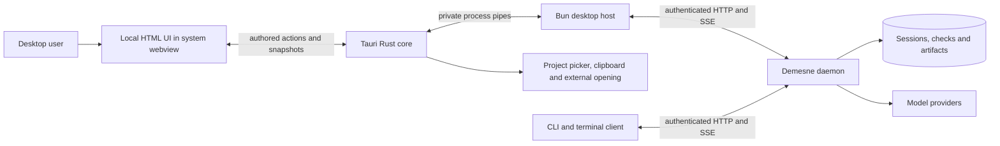

# Demesne desktop

[Desktop user guide](../../docs/desktop.md) · [Architecture](../../docs/architecture.md) · [Contributing](../../CONTRIBUTING.md)

The Tauri 2 client displays Demesne's shared web frontend directly in a desktop window. Its Rust core starts a Bun host sidecar and supplies a restricted native bridge. The host reuses the authenticated daemon client, provider setup, session state, and Drive controller from the graphics interface.

## Process boundary



Credentials and authenticated requests stay in the host/daemon. The webview receives public snapshots and sends named, validated actions. Native commands require the main window and a local application origin. The window denies navigation to remote pages and creation of additional webviews; external links open through the validated native opener. Its capability file only permits backend event subscriptions, without renderer shell/filesystem plugin permissions. Rendered Markdown remains sanitized.

The frontend has no general shell, filesystem, or authenticated daemon HTTP API. Approved commands still run as the user's OS account in the daemon; moving to Tauri does not sandbox agent tools. See [security boundaries](../../SECURITY.md).

## Run and package

From the repository root, after installing [platform prerequisites](../../docs/desktop.md#prerequisites):

```sh
bun install --frozen-lockfile
bun run desktop
bun run build:desktop
```

The host and daemon are compiled with Bun and included as resources/sidecars alongside native image codecs. The frontend's HTML/CSS/assets and live UI are shared with `apps/graphics`; changes should preserve terminal behavior as well as native-webview behavior.

The desktop process owns the window and its host. The independent daemon owns coding turns. Window exit disposes client streams and Drive without killing the daemon. Private `desktop-ui.json` preferences remember the last project and session per canonical project/daemon pair; missing or archived sessions fall back to a new session. A project change creates a host for that selected workspace; existing session work remains daemon-owned.

## Verification

```sh
bun run typecheck
bun test
bun run build:desktop -- --debug --no-bundle
DEMESNE_TEST_DESKTOP_HOST="$PWD/apps/desktop/src-tauri/target/debug/demesne-desktop-host" \
  bun test apps/desktop/test/host.test.ts
bun scripts/check-desktop-backend.ts
cargo test --locked --manifest-path apps/desktop/src-tauri/Cargo.toml
```

The compiled-host tests cover validated IPC, malformed messages, native response correlation, project/session restoration, and EOF/quit cleanup. The backend check boots the bundled daemon with its relocated native image runtime under disposable configuration. Neither check opens a window or uses a real provider.

On Linux with the WebDriver dependencies installed:

```sh
dbus-run-session -- xvfb-run -a bun run desktop:check
```

The Linux desktop check uses disposable configuration, workspace, and deterministic inference. It submits a turn through the composer, approves an actual file edit and check, verifies Markdown/code/math and review panels, reopens the saved project/session, and confirms daemon work finishes after the app closes. Screenshots and logs are written to `test-results/desktop/`. It exercises the application boundary without a real account or model. Tests must clean up their own app/host/daemon processes and must never stop a user's active daemon.

The native WebDriver route is Linux-only in this milestone; macOS needs separate native app validation because WKWebView has no platform WebDriver. On Linux, the real-webview check needs `webkit2gtk-driver`, `xvfb`, and `tauri-driver`. The [desktop CI workflow](../../.github/workflows/desktop.yml) supplies these dependencies. This follows [Tauri's native WebDriver testing route](https://v2.tauri.app/develop/tests/webdriver/manual-setup/), without a production test server or privileged renderer test API.

The first desktop milestone preserves current product behavior; it does not implement an updater, tray background mode, signing/notarization, or validated Windows packaging. Native capture remains macOS-only. Render and performance claims must identify the tested platform and complete process boundary.
