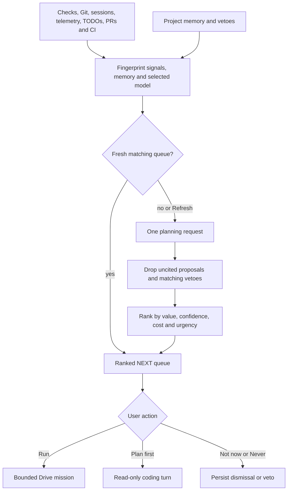
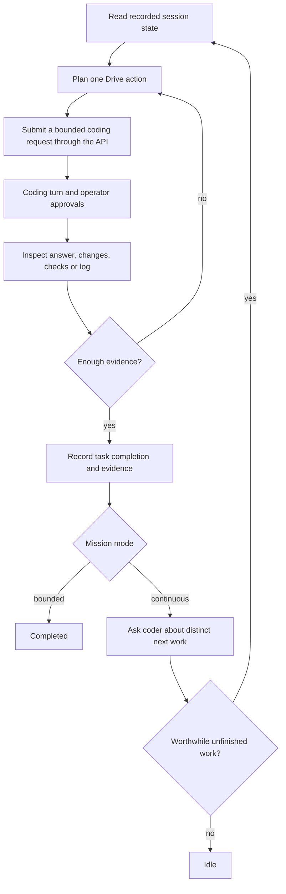

# Agent Drive

[Documentation index](README.md) · [Subagents](subagents.md) · [Architecture](architecture.md)

Drive is a separate planning context that coordinates coding turns, inspects recorded evidence, and decides whether a mission is complete. Its orchestration runs in the graphics host; the daemon owns model inference, coding tools, approvals, and durable session records.

## Start and control a mission

```text
/drive --bounded Finish the parser change and verify its tests
/drive --continuous Improve the parser within the current project goals
/drive pause
/drive resume
/drive stop
/drive reopen TASK_ID Explain what changed since completion
```

**Plain `/drive MISSION` currently defaults to continuous mode.** Use `--bounded` for one verified task. The graphics mission form's **Keep choosing improvements** checkbox chooses the same distinction; a saved mission retains its mode. A question can finish when answered in either mode. `/drive` or Alt+J opens the panel.

- **Pause** stops planning; an already submitted coding turn can finish.
- **Stop** also attempts to interrupt coding work in the mission session.
- **Resume** re-observes current state and retains the ledger. It cannot silently restart completed work or clear a protection stop.
- Human typing, pasting and actionable input take over from Drive. Viewing its own progress panel and passive scrolling do not by themselves request new coding work.
- Drive cannot approve a tool or answer a human question. It waits for the operator.

## NEXT: proposed work

When idle, the Drive panel opens on **NEXT**. The start screen shows the top three proposals, and the rail shows the available proposal count.

| Action | Result |
| --- | --- |
| Run | Start a **bounded** mission for that proposal |
| Plan first | Submit a read-only planning turn |
| Not now | Hide that proposal for 24 hours |
| Never | Hide its stable proposal ID and record a project-memory veto |
| Refresh | Recollect signals and regenerate proposals explicitly |

Run/Plan selections are hidden for six hours to avoid immediate repetition. Dismissals are private, per-workspace client state. A proposal is advice until the user selects an action; collection and planning do not apply file changes.



[Signal collection](../apps/daemon/src/drive-signals.ts) uses recent failed checks, unfinished failed/interrupted asks, agent telemetry, uncommitted files, old unmerged branches, tracked-code TODOs, open PRs, and the latest default-branch run for each CI workflow. It excludes protected files before searching and bounds command output. GitHub collection uses `gh` when available; missing Git/GitHub access does not prevent local signals.

[Proposal generation](../apps/daemon/src/drive-next.ts) requires cited signal IDs and ranks value × confidence ÷ estimated cost, with an urgent-evidence boost. It returns at most six items. Estimates of minutes, confidence and coders are model estimates, not reservations of runtime capacity.

Queues are cached for up to 12 hours when signals, memory, and selected model match. The graphics host requests them on connection and after settled turns when its 30-minute refresh interval has elapsed; Refresh bypasses the cache. A new veto invalidates the prior cache. Exact matching titles are filtered; semantic veto instructions and task-overlap judgments are not a perfect paraphrase detector.

## Direct control is the default



[DirectDriveControl](../apps/graphics/drive-direct.ts) builds observations from daemon-recorded session data and submits work through the host/API. It inspects answers, diffs, checks, and logs without typing into or navigating the screen. The UI displays the activity. Direct-mode planner actions do not include arbitrary clicks, keys or scrolling.

`DEMESNE_DRIVE_CONTROL=ui` retains the compatibility route: clipped visible DOM observations, authored controls, stale-observation checks, and short-lived capabilities for the exact submitted text. Those UI capabilities do not authorize arbitrary execution or approvals. Screen-control descriptions in older notes refer to this compatibility mode, not the current default.

Both paths use a separate planner context. Drive sees bounded observations, project memory, recorded facts, and inspected evidence—not the coder's full private context. Tool output and repository text are untrusted evidence. A summary saying that tests passed is not equivalent to recorded passing checks.

## Project memory and task ledger

```text
/drive remember Preserve the public CLI commands
/drive forget MEMORY_ID
```

[Project memory](../apps/cli/src/drive-memory.ts) is an append-only private JSONL journal of preferences, decisions, outcomes, blockers and vetoes. The planner receives a bounded selection: standing entries first, then recent learned entries, within 60 entries/8,000 characters. Session UI shows the saved entries; nothing in this memory grants tool permission.

The mission journal and memory are stored under `<data_dir>/drive/`, keyed by daemon and workspace. Unfinished missions reopen paused; the controller does not replay old actions automatically. A journal lock prevents concurrent writers.

The [task ledger](../apps/cli/src/drive-tasks.ts) records stable IDs, goals, acceptance criteria, worker turn IDs, completion revisions and evidence. Criteria cannot be redefined after work starts. Completed work stays completed until an explicit reopen, or a validated automatic reopen citing a relevant changed file/newly failing check. Rephrasing a goal or asking for another summary does not establish new work. Earlier completion evidence remains attached after reopening.

Continuous discovery gets a coder consultation and a bounded clarification opportunity. A next task must be grounded in the current consultation, within the mission, and distinct from finished work. When evidence offers no useful next task, Drive idles.

## Live coder check-ins

[Checkpoint reviews](../apps/cli/src/drive-checkpoints.ts) react to completed checks, batches of at least two edits, or repeated tool calls. The controller coalesces these signals with a 15-second cooldown. The configured interval (default 120 seconds) remains a periodic fallback.

A review acquires the relevant model slot; it does not interrupt an active inference request simply to look. The daemon assembles a **fresh** packet after queueing, using event cursors, tool results, file revisions, and check state. One-slot servers interleave reviews at inference boundaries; provider-specific concurrency can allow overlap.

The planner can keep the worker going or propose a targeted redirect. Cancellation is guarded by session/turn/cursor/revision checks, so an old review cannot cancel newer work. Reviews cannot approve tools, issue arbitrary screen actions, or claim mission completion. Requests and corrections count against mission allowances. [Daemon review validation](../apps/daemon/src/drive-review.ts) · [guarded cancellation route](../apps/daemon/src/app.ts).

## Mission limits

Defaults come from [the protocol](../packages/protocol/src/drive.ts):

| Limit | Default |
| --- | ---: |
| Active mission minutes | 240 |
| Controller/planning cycles | 512 |
| Completed tasks | 16 |
| Worker submissions, including consultations/corrections | 48 |
| Accounted input/output tokens | 2,000,000 |
| Cycles without recorded progress | 24 |
| Check-in interval | 120 seconds |
| Check-ins / redirects | 24 / 3 |

```toml
[drive]
max_active_minutes = 240
max_cycles = 512
max_tasks = 16
max_worker_requests = 48
max_tokens = 2000000
max_stalled_cycles = 24
check_in_interval_seconds = 120
max_check_ins = 24
max_redirects = 3
```

These client-loaded limits apply to **new** missions. Task/submission histories are bounded at 64 tasks/256 worker requests. Active time excludes explicit pauses and time with the client closed. Tokens use receipts where available and estimates until then; the budget is not a billing quote or a zero-overshoot guarantee.

[Loop protection](../apps/cli/src/drive-protection.ts) detects unchanged repeated submissions, recurring navigation cycles, and overlap with completed goals. It uses recorded file/check outcomes, not clocks or newly generated prose, as progress. A protection stop persists across restarts and ordinary Resume. Review the reason and start a deliberate new mission if the scope should change.

## Verification and boundaries

The UI exposes planning attempts, reasoning summaries when provided, decisions, results, receipts and saved evidence. These traces are not evidence of the coder's success by themselves. Resume refreshes current facts; rebuilding without restarting leaves old daemon routes active.

```sh
bun test apps/daemon/test/agent-drive.test.ts apps/daemon/test/drive-review.test.ts apps/daemon/test/drive-next.test.ts
bun test apps/graphics/test/drive-direct.test.ts
bun apps/graphics/check-drive-tasks.ts /tmp/demesne-drive-check
bun apps/graphics/check-drive-tasks.ts /tmp/demesne-drive-retina --retina
bun apps/graphics/check-drive-next.ts /tmp/demesne-next-check
```

The graphics checks exercise real daemon APIs and terminal pixel transport with deterministic model fixtures. They do not demonstrate that an arbitrary model will make good autonomous decisions. Drive still depends on model judgment and the operator's approval policy.
