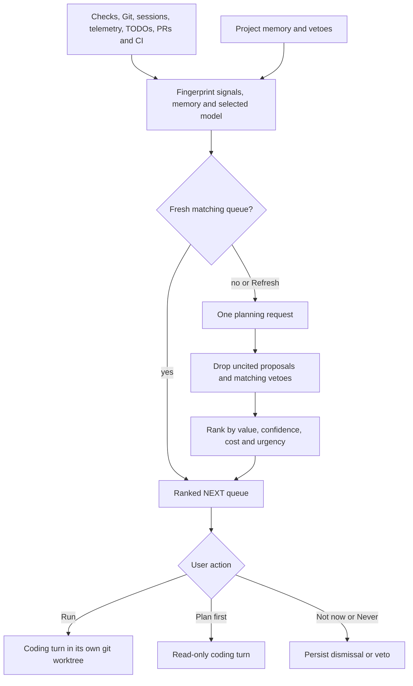
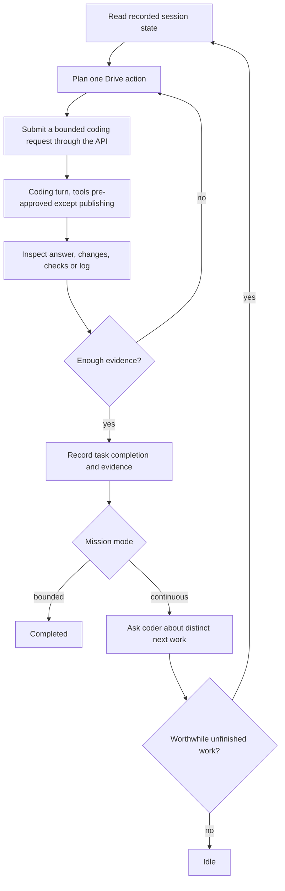

# Agent Drive

[Documentation index](README.md) · [Subagents](subagents.md) · [Architecture](architecture.md)

Drive is a separate planning context that coordinates coding turns, inspects recorded evidence, and decides whether a mission is complete. Its orchestration runs in the interface host; the daemon owns model inference, coding tools, approvals, and durable session records.

## Start and control a mission

```text
/drive --bounded Finish the parser change and verify its tests
/drive --continuous Improve the parser within the current project goals
/drive pause
/drive resume
/drive stop
/drive reopen TASK_ID Explain what changed since completion
/drive --here --bounded Run this one in the current session
```

**Every new mission works in its own git worktree** (see [Missions work in a worktree](#missions-work-in-a-worktree)). Add `--here` to keep it in the current session.

**Plain `/drive MISSION` currently defaults to continuous mode.** Use `--bounded` for one verified task. A saved mission retains its mode. A question can finish when answered in either mode. `/drive` or Alt+J opens the panel.

- **Pause** stops planning; an already submitted coding turn can finish.
- **Stop** also attempts to interrupt coding work in the mission session.
- **Resume** re-observes current state and retains the ledger. It cannot silently restart completed work or clear a protection stop.
- Human typing, pasting and actionable input take over from Drive. Viewing its own progress panel and passive scrolling do not by themselves request new coding work.
- Drive's coding turns are submitted with permission mode `allow`: every edit and command runs without asking, because Drive is meant to work unattended. Commands that publish beyond the machine still ask: `git push`, `gh pr`/`release`/`repo`/`gist` create, merge, edit, delete and similar, `gh api` writes, and `npm`/`pnpm`/`yarn`/`bun publish` (including inside `sh -c` scripts). Your own turns still ask. Drive cannot answer a human question; it waits for you.

## NEXT: proposed work

The Drive panel pins a live, paused or blocked mission at the top (status, tasks, stats, Pause/Resume, Stop, Details), with two tabs below it. **Next** is the ranked proposal queue as one-line rows; the top one, or the one you open, shows its reason, evidence, estimate and actions. **Done** shows the finished mission in full, then the outcomes and blockers Drive recorded in project memory, newest first. Missions start from `/drive` in the composer. The start screen shows the top three proposals, and the rail shows the available proposal count.

| Action | Result |
| --- | --- |
| Run | Do it in its own git worktree and branch, then show the result to Apply, Open PR or Discard ([below](#run-works-in-a-worktree)) |
| Plan first | Submit a read-only planning turn |
| Not now | Hide that proposal for 24 hours |
| Never | Hide its stable proposal ID and record a project-memory veto |
| Refresh | Recollect signals and regenerate proposals explicitly |

Run/Plan selections are hidden for six hours to avoid immediate repetition. Dismissals are private, per-workspace client state. A proposal is advice until the user selects an action; collection and planning do not apply file changes.



[Signal collection](../apps/daemon/src/drive-signals.ts) uses recent failed checks, unfinished failed/interrupted asks, agent telemetry, uncommitted files, old unmerged branches, tracked-code TODOs, open PRs, and the latest default-branch run for each CI workflow. It excludes protected files before searching and bounds command output. GitHub collection uses `gh` when available; missing Git/GitHub access does not prevent local signals.

[Proposal generation](../apps/daemon/src/drive-next.ts) requires cited signal IDs and ranks value × confidence ÷ estimated cost, with an urgent-evidence boost. It returns at most six items. Estimates of minutes, confidence and coders are model estimates, not reservations of runtime capacity.

### Drive learns its own accuracy

Each proposal you **Run** leaves an outcome in `drive-calibration.jsonl` in the daemon's data directory: **landed** (applied or opened as a PR), **discarded** after review, **failed**, or **unchanged** (the coder found nothing to change). An investigation that rightly changes nothing records no outcome. Landed and reviewed runs also record how long they really took.

[Calibration](../apps/daemon/src/drive-calibration.ts) then ranks the queue with this project's evidence instead of the model's word. For each confidence level, the weight is the observed landing rate smoothed toward the default (high 1, medium 0.7, low 0.4) as if that default were three earlier outcomes, so a single run moves it only a little. Once three runs are timed, estimates are scaled by the median ratio of real to estimated time (clamped to 0.25–4×), and the queue shows the scaled estimate. Only the 50 most recent outcomes per project count. The Next heading then reads, for example, "Drive's picks landed 7 of 9 here · runs take ~1.4× its estimates"; hover it for the breakdown by confidence. Cached queues are re-ranked on every request, so a new outcome changes the order without another model call.

Queues are cached for up to 12 hours when signals, memory, and selected model match. The interface host requests them on connection and after settled turns when its 30-minute refresh interval has elapsed; Refresh bypasses the cache. A new veto invalidates the prior cache. Exact matching titles are filtered; semantic veto instructions and task-overlap judgments are not a perfect paraphrase detector.

## Run works in a worktree

Pressing **Run** on a proposal never touches your checkout. Drive creates a git worktree on a new branch named after the proposal (`drive/tidy-…`, `drive/fix-…`, `drive/investigate-…`) and runs one coding turn there with every tool allowed. The prompt is the proposal's title, why and cited evidence. The coder is told to confirm the task is real, keep the change small, and run the checks that cover it. Your files and conversation stay as they are, so you can keep working while it runs.

When it finishes, demesne commits the change on that branch and shows the same card as a breakage fix: the diff size, the files, the checks that ran and the coder's summary, with **Apply to my branch**, **Open PR** and **Discard**. If the coder decides nothing needs changing (common for an investigation), the card says so with its summary, and Discard cleans up. Only one worktree job runs per project at a time.

Outside a git repository, or in one with no commits yet, Run falls back to a **bounded** mission in the current session.

## Missions work in a worktree

A new `/drive` mission doesn't touch your checkout either. Drive creates a git worktree on a branch named after the mission (`drive/mission-…`), opens a session rooted there and moves you into it. The planner, check-ins and every coding turn then run in that session, with the same limits and evidence as before. Your original session and files stay as they were.

When the mission settles (completed, idle or stopped), demesne commits what changed on the branch and shows the review card: diff size, files, the checks the mission ran and its summary, with **Apply to my branch**, **Open PR** and **Discard**. Applying or discarding takes you back to the session you started from. If you resume a settled mission, it keeps working in the same worktree, and the next settle adds a commit.

### Mission receipts

The review card leads with a receipt headline such as "2 of 3 tasks verified · 4 checks passing", and **Copy receipt** copies the full receipt as Markdown. **Open PR** puts it at the top of the pull request. The receipt is built from the [task ledger](#project-memory-and-task-ledger) and recorded checks, not from the model's summary:

- ✓ **verified**: the task's latest completion has recorded checks, all passing and current for the final files (or it was a question that was answered).
- △ **claimed, not verified**: the task was marked complete, but a check failed, went stale or never ran.
- ○ **not finished**.

Each task lists its acceptance criteria, result, checks (failed and stale ones are named) and files, and the receipt ends with the mission's usage: coder requests, planning cycles, active minutes and an estimated token count.

While a mission's worktree is open, no other worktree job (a breakage fix or a proposal Run) starts in that project: apply or discard it first. A daemon restart keeps the worktree open; the mission reopens paused as usual.

`/drive --here MISSION` runs in the current session instead. So does any mission outside a git repository, in one with no commits, or under `DEMESNE_DRIVE_CONTROL=ui`. The worktree links your `node_modules` rather than reinstalling, so a coder that installs packages there changes your checkout's dependencies too.

## Drive keeps working when you close the window

Closing the window doesn't stop a running mission. The window's host hands it to a small background process with no window (the same desktop host, started with `--drive-away`). That process resumes the mission on the same session and keeps going until the mission settles. A worktree mission is then committed for review, just as it would be with the window open, and the process exits. When you open the project again, the window stops the background process and resumes the mission itself, so you're back in the same session with Drive still working. A mission that settled while you were away shows its review card.

Only a running mission is handed off. Pause or Stop it before closing if you want it to wait. Its limits still apply, and its active time keeps counting while it works in the background. Approvals still ask: a mission waiting on one waits until you reopen the window. The process writes to `drive/away.log` in the data directory, and `<journal>.away.json` next to the mission journal records which process has it. The screen-driven route (`DEMESNE_DRIVE_CONTROL=ui`) needs the window, so it still pauses on close. [Implementation](../apps/desktop/drive-away.ts)

## Breakage alerts: fix it in a worktree

When something **newly** breaks, a card pops up over the conversation: a check that starts failing, CI on the default branch turning red, or an open pull request whose CI fails. Only changes alert. Whatever was already broken when demesne opened stays in the Next queue, and nothing pops up while a turn is running. Local checks are looked at every two minutes and after each turn; GitHub at most every five minutes. No model runs until you choose:

- **Fix in a worktree**: Drive creates a git worktree on a new branch (`drive/fix-…`) beside the data directory (`~/.demesne-worktrees`), links your `node_modules` into it, and runs a coding turn there with every tool allowed. Your files and conversation are untouched. The card shows the steps as they happen.
- **Not now** hides the card until the next new breakage; **Never for this** remembers to skip that alert (a veto in project memory).

When the fix finishes, demesne commits it on the branch and the card shows the diff size, the files, the checks the agent ran, and its summary:

- **Apply to my branch** cherry-picks the fix onto your current branch, then removes the worktree and branch. If it doesn't apply cleanly (for example, your uncommitted changes touch the same file), nothing changes and the fix stays on its branch.
- **Open PR** pushes the branch and opens a pull request with the evidence. Since you clicked it, it doesn't ask again.
- **Discard** (or **Stop and discard** while running) removes the worktree and branch.

## Direct control is the default



[DirectDriveControl](../apps/graphics/drive-direct.ts) builds observations from daemon-recorded session data and submits work through the host/API. It inspects answers, diffs, checks, and logs without typing into or navigating the screen. The UI displays the activity. Direct-mode planner actions do not include arbitrary clicks, keys or scrolling.

`DEMESNE_DRIVE_CONTROL=ui` retains the compatibility route: clipped visible DOM observations, authored controls, stale-observation checks, and short-lived capabilities for the exact submitted text. Those UI capabilities do not authorize arbitrary execution or approvals. Screen-control descriptions in older notes refer to this compatibility mode, not the current default.

Both paths use a separate planner context. Drive sees bounded observations, project memory, recorded facts, and inspected evidence—not the coder's full private context. Tool output and repository text are untrusted evidence. A summary saying that tests passed is not equivalent to recorded passing checks.

## Project memory and task ledger

```text
/drive remember Preserve the public CLI commands
/drive forget MEMORY_ID
```

[Project memory](../apps/cli/src/drive-memory.ts) is an append-only private JSONL journal of preferences, decisions, outcomes, blockers and vetoes. The planner receives a bounded selection: standing entries first, then recent learned entries, within 60 entries/8,000 characters. Session UI shows the saved entries; nothing in this memory grants tool permission.

The mission journal and memory are stored under `<data_dir>/drive/`, keyed by daemon and workspace. Unfinished missions reopen paused; the controller does not replay old actions automatically. A journal lock prevents concurrent writers.

The [task ledger](../apps/cli/src/drive-tasks.ts) records stable IDs, goals, acceptance criteria, worker turn IDs, completion revisions and evidence. Criteria cannot be redefined after work starts. Completed work stays completed until an explicit reopen, or a validated automatic reopen citing a relevant changed file/newly failing check. Rephrasing a goal or asking for another summary does not establish new work. Earlier completion evidence remains attached after reopening.

Continuous discovery gets a coder consultation and a bounded clarification opportunity. A next task must be grounded in the current consultation, within the mission, and distinct from finished work. When evidence offers no useful next task, Drive idles.

## Live coder check-ins

[Checkpoint reviews](../apps/cli/src/drive-checkpoints.ts) react to completed checks, batches of at least two edits, or repeated tool calls. The controller coalesces these signals with a 15-second cooldown. The configured interval (default 120 seconds) remains a periodic fallback.

A review acquires the relevant model slot; it does not interrupt an active inference request simply to look. The daemon assembles a **fresh** packet after queueing, using event cursors, tool results, file revisions, and check state. One-slot servers interleave reviews at inference boundaries; provider-specific concurrency can allow overlap.

The planner can keep the worker going or propose a targeted redirect. Cancellation is guarded by session/turn/cursor/revision checks, so an old review cannot cancel newer work. Reviews cannot approve tools, issue arbitrary screen actions, or claim mission completion. Requests and corrections count against mission allowances. [Daemon review validation](../apps/daemon/src/drive-review.ts) · [guarded cancellation route](../apps/daemon/src/app.ts).

## Mission limits

Defaults come from [the protocol](../packages/protocol/src/drive.ts):

| Limit | Default |
| --- | ---: |
| Active mission minutes | 240 |
| Controller/planning cycles | 512 |
| Completed tasks | 16 |
| Worker submissions, including consultations/corrections | 48 |
| Accounted input/output tokens | 2,000,000 |
| Cycles without recorded progress | 24 |
| Check-in interval | 120 seconds |
| Check-ins / redirects | 24 / 3 |

```toml
[drive]
max_active_minutes = 240
max_cycles = 512
max_tasks = 16
max_worker_requests = 48
max_tokens = 2000000
max_stalled_cycles = 24
check_in_interval_seconds = 120
max_check_ins = 24
max_redirects = 3
```

These client-loaded limits apply to **new** missions. Task/submission histories are bounded at 64 tasks/256 worker requests. Active time excludes explicit pauses, but counts time a mission works in the background with the window closed. Tokens use receipts where available and estimates until then; the budget is not a billing quote or a zero-overshoot guarantee.

[Loop protection](../apps/cli/src/drive-protection.ts) detects unchanged repeated submissions, recurring navigation cycles, and overlap with completed goals. It uses recorded file/check outcomes, not clocks or newly generated prose, as progress. A protection stop persists across restarts and ordinary Resume. Review the reason and start a deliberate new mission if the scope should change.

## Verification and boundaries

The UI exposes planning attempts, reasoning summaries when provided, decisions, results, receipts and saved evidence. These traces are not evidence of the coder's success by themselves. Resume refreshes current facts; rebuilding without restarting leaves old daemon routes active.

```sh
bun test apps/daemon/test/agent-drive.test.ts apps/daemon/test/drive-review.test.ts apps/daemon/test/drive-next.test.ts
bun test apps/graphics/test/drive-direct.test.ts apps/graphics/test/drive-facts.test.ts
```

These tests use deterministic model fixtures. They do not demonstrate that an arbitrary model will make good autonomous decisions. Drive still depends on model judgment and the operator's approval policy.
