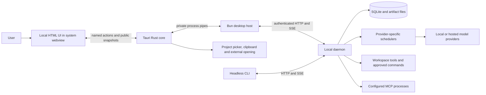
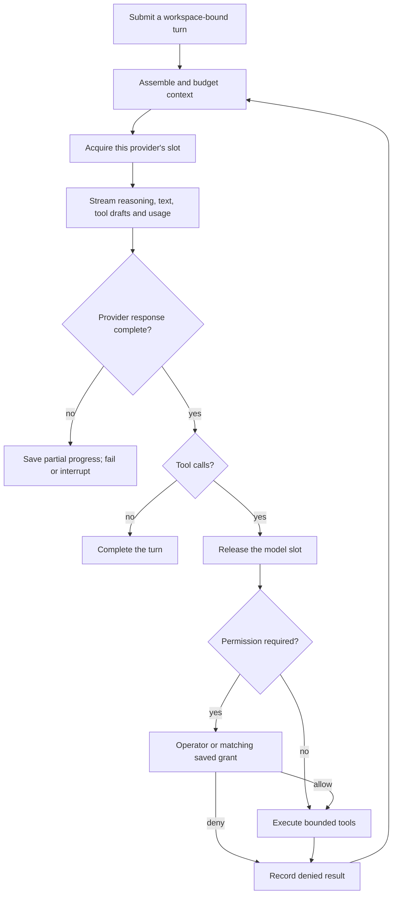
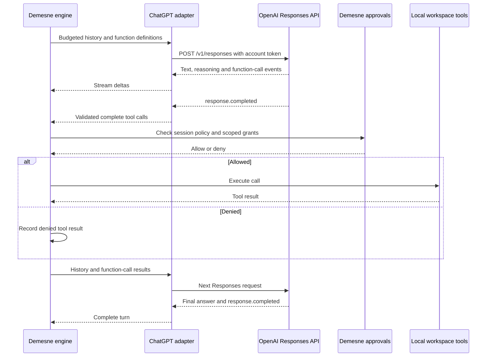

# Architecture and API map

[Documentation index](README.md) · [Configuration](configuration.md) · [Security](../SECURITY.md)

## Processes and ownership

The [CLI entry point](../apps/cli/src/main.ts) opens the desktop window from an interactive terminal through the [desktop launcher](../apps/cli/src/desktop-launcher.ts) and exposes headless commands. The [shared host](../apps/graphics/host.ts) owns the authenticated client, local UI state, config writes, and browser opening; the [desktop host](../apps/desktop/host.ts) runs it beside the window. The web page has no Node API, daemon token, or unrestricted network access.

The [daemon](../apps/daemon/src/app.ts) owns turns and background commands. Closing the UI does not stop daemon-owned coding work. Drive's orchestration loop is client-owned; its journal is saved, and a running mission carries on in a background host when the window closes ([below](#desktop-process-boundary)). The [store](../packages/storage/src/index.ts) marks interrupted daemon work on restart instead of replaying side effects.

## Desktop process boundary

The [Tauri desktop preview](desktop.md) displays the shared UI in the system webview. Its Rust core supplies native project selection, clipboard, and external opening, while a compiled Bun host owns the authenticated daemon client and Drive controller. Public state and named actions cross private process pipes and the restricted Tauri bridge; daemon/provider credentials stay outside the webview. Native commands check both the main-window label and local origin; remote navigation and new webviews are denied.

Closing the window ends its host. A running Drive mission is handed to a detached host process with no window, which resumes it and exits once it settles; reopening the project stops that process and resumes the mission in the window ([Drive keeps working](agent-drive.md#drive-keeps-working-when-you-close-the-window)). Daemon-owned turns continue, and the project/session can be reopened. See the [desktop implementation](../apps/desktop/README.md#process-boundary).

## One coding turn

The [engine](../apps/daemon/src/engine.ts) executes tools only after validating response completion. Context compaction, tool allowances, and request timeouts remain separate controls. File evidence, approvals, check outcomes, and usage are journaled with their original turn attribution.

[Subagents](subagents.md) have separate transcripts and restricted tools. Their requests use the selected provider's scheduler. [Drive](agent-drive.md) is another planning context; it submits and inspects coding work rather than receiving the coder's complete internal context.

## Providers and authentication

| Adapter | Transport | Credential source |
| --- | --- | --- |
| [OpenAI-compatible](../packages/providers/src/index.ts) | `/v1/models`, streamed Chat Completions | Optional provider API key |
| [ChatGPT](../packages/providers/src/chatgpt.ts) | Public `/v1/models` catalog and streamed `/v1/responses` | [Demesne's OAuth store](../packages/chatgpt-auth/src/index.ts) |

The Responses adapter retains completed output items, including encrypted reasoning, for stateless continuation. An empty terminal `response.output` does not discard previously completed stream items. Incomplete/conflicting calls remain errors. A provider change does not send another provider's opaque continuation state to it.

A [multi-provider processor](../apps/daemon/src/multi-provider-processor.ts) routes model IDs. Duplicate model IDs across providers are rejected as ambiguous. Inference settings are captured for a turn; model selection does not rewrite an already-running request.

### Direct ChatGPT tool flow

The [ChatGPT adapter](../packages/providers/src/chatgpt.ts) sends model-visible history and Demesne's function definitions directly to the public Responses API. It uses the selected account's OAuth token, `store: false` and streamed events. Demesne assembles context, validates response completion and executes tools through its existing workspace and approval policy. No external coding-agent process owns the conversation or executes native tools.

Function calls and results keep their original call IDs in subsequent requests. Denied calls produce tool results too, so the model can respond to the refusal. Completed output and opaque reasoning are retained with the local transcript for continuation, scoped to the matching account and model. Plan mode supplies inspection tools only; Build tools still pass through Demesne's permissions, including the session's auto-approve setting.

Only a completed response permits execution. Failed, incomplete or interrupted streams and malformed/conflicting calls remain failures. Account model discovery normally performs no inference; explicitly selecting Sol when it is missing from the catalog runs a small verification request before saving that choice. See [authentication](authentication.md#continue-with-chatgpt) for account access and plan usage.

## API map

All production routes except `/healthz` require the daemon bearer token. This is a navigation map, not a replacement for the [typed client](../packages/client/src/index.ts) and [protocol types](../packages/protocol/src/index.ts).

| Surface | Routes |
| --- | --- |
| Health and capacity | `GET /healthz`, `GET /v1/status`, `GET /v1/runtime` |
| Models | `GET /v1/models`, `POST /v1/model`, `GET/POST /v1/subagent-model` |
| Sessions | `GET/POST /v1/sessions`, `GET/PATCH/DELETE /v1/sessions/:id` |
| Turns and history | Session turn submission, compact, replay, export, changes, review and undo routes |
| Live events | `GET /v1/events` with session and event cursor |
| Tools | Permission resolution, [question actions and recovery](questions.md), workspace file and command routes |
| Drive | `POST /v1/drive/next`, `POST /v1/drive/decide`, worktree fixes and `GET/POST /v1/drive/away` (away mode), session Drive facts, guarded check-in cancellation |
| Images | Session artifact list, metadata, content and import routes |

SSE clients resume from event cursors and use bounded replay to recover gaps. Filesystem operations resolve against the session's canonical workspace. Image bytes use [authenticated binary routes](artifact-preview-implementation.md), not event JSON.

## Storage and lifecycle

The default data directory is `~/.demesne`, overridden by `data_dir` or `DEMESNE_DATA_DIR`.

| Data | Owner/location |
| --- | --- |
| Sessions, events, tools, approvals, question progress/drafts, checkpoints, commands, artifact descriptors | Daemon SQLite database |
| Immutable image originals and previews | `artifacts/` beside the database |
| Daemon token, PID, log and lock | Data directory |
| ChatGPT tokens and issued registrations | `auth/chatgpt.json` |
| Drive journals, project memory and dismissals | `drive/` |
| Daemon proposal cache | `drive-next/` |
| Desktop project/session preferences | `desktop-ui.json` |
| Panel preferences | `graphics-ui.json` |
| Open-original preview copies | `preview-cache/` |

The desktop host exits cleanly on EOF or quit and disposes its client streams and Drive without stopping the daemon. See the [desktop implementation](../apps/desktop/README.md#process-boundary) and [troubleshooting](troubleshooting.md).
