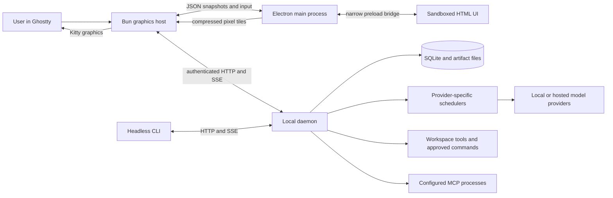
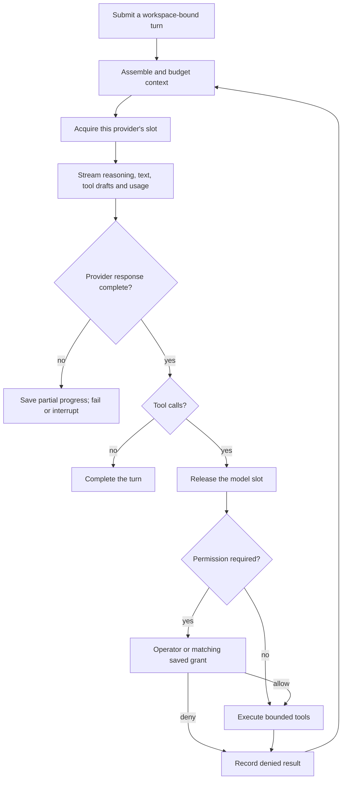

# Architecture and API map

[Documentation index](README.md) · [Configuration](configuration.md) · [Security](../SECURITY.md)

## Processes and ownership

The [CLI entry point](../apps/cli/src/main.ts) routes interactive chat to graphics and exposes headless commands. The [graphics host](../apps/graphics/host.ts) owns the authenticated client, local UI state, config writes, and browser opening. [Electron](../apps/graphics/renderer.cjs) renders offscreen and forwards only authored bridge requests. The browser page has no Node API, daemon token, or unrestricted network access.

The [daemon](../apps/daemon/src/app.ts) owns turns and background commands. Closing the UI does not stop daemon-owned coding work. Drive's orchestration loop is client-owned; its journal is saved and an unfinished mission resumes paused. The [store](../packages/storage/src/index.ts) marks interrupted daemon work on restart instead of replaying side effects.

## Desktop process boundary

The [Tauri desktop preview](desktop.md) displays the shared UI in the system webview. Its Rust core supplies native project selection, clipboard, and external opening, while a compiled Bun host owns the authenticated daemon client and Drive controller. Public state and named actions cross private process pipes and the restricted Tauri bridge; daemon/provider credentials stay outside the webview. Native commands check both the main-window label and local origin; remote navigation and new webviews are denied.

Closing the window ends its host and Drive orchestration. Daemon-owned turns continue, and the project/session can be reopened. The terminal client retains its existing Electron and Kitty graphics path. See the [desktop implementation](../apps/desktop/README.md#process-boundary).

## One coding turn

The [engine](../apps/daemon/src/engine.ts) executes tools only after validating response completion. Context compaction, tool allowances, and request timeouts remain separate controls. File evidence, approvals, check outcomes, and usage are journaled with their original turn attribution.

[Subagents](subagents.md) have separate transcripts and restricted tools. Their requests use the selected provider's scheduler. [Drive](agent-drive.md) is another planning context; it submits and inspects coding work rather than receiving the coder's complete internal context.

## Providers and authentication

| Adapter | Transport | Credential source |
| --- | --- | --- |
| [OpenAI-compatible](../packages/providers/src/index.ts) | `/v1/models`, streamed Chat Completions | Optional provider API key |
| [ChatGPT](../packages/providers/src/chatgpt.ts) | Public `/v1/models` catalog and streamed `/v1/responses` | [Demesne's OAuth store](../packages/chatgpt-auth/src/index.ts) |

The Responses adapter retains completed output items, including encrypted reasoning, for stateless continuation. An empty terminal `response.output` does not discard previously completed stream items. Incomplete/conflicting calls remain errors. A provider change does not send another provider's opaque continuation state to it.

A [multi-provider processor](../apps/daemon/src/multi-provider-processor.ts) routes model IDs. Duplicate model IDs across providers are rejected as ambiguous. Inference settings are captured for a turn; model selection does not rewrite an already-running request.

## API map

All production routes except `/healthz` require the daemon bearer token. This is a navigation map, not a replacement for the [typed client](../packages/client/src/index.ts) and [protocol types](../packages/protocol/src/index.ts).

| Surface | Routes |
| --- | --- |
| Health and capacity | `GET /healthz`, `GET /v1/status`, `GET /v1/runtime` |
| Models | `GET /v1/models`, `POST /v1/model`, `GET/POST /v1/subagent-model` |
| Sessions | `GET/POST /v1/sessions`, `GET/PATCH/DELETE /v1/sessions/:id` |
| Turns and history | Session turn submission, compact, replay, export, changes, review and undo routes |
| Live events | `GET /v1/events` with session and event cursor |
| Tools | Permission/question resolution, workspace file and command routes |
| Drive | `POST /v1/drive/next`, `POST /v1/drive/decide`, session Drive facts, guarded check-in cancellation |
| Images | Session artifact list, metadata, content and import routes |

SSE clients resume from event cursors and use bounded replay to recover gaps. Filesystem operations resolve against the session's canonical workspace. Image bytes use [authenticated binary routes](artifact-preview-implementation.md), not event JSON.

## Storage and lifecycle

The default data directory is `~/.demesne`, overridden by `data_dir` or `DEMESNE_DATA_DIR`.

| Data | Owner/location |
| --- | --- |
| Sessions, events, tools, approvals, checkpoints, commands, artifact descriptors | Daemon SQLite database |
| Immutable image originals and previews | `artifacts/` beside the database |
| Daemon token, PID, log and lock | Data directory |
| ChatGPT tokens and issued registrations | `auth/chatgpt.json` |
| Drive journals, project memory and dismissals | `drive/` |
| Daemon proposal cache | `drive-next/` |
| Desktop project/session preferences | `desktop-ui.json` |
| Panel preferences | `graphics-ui.json` |
| Open-original preview copies | `preview-cache/` |
| Pixel transfers and browser cache | Private temporary directories |

The renderer and terminal host stop writing when their pipes close. The renderer exits cleanly on EOF, EPIPE, quit or termination; snapshot notifications flush before exit. See [graphics lifecycle](../apps/graphics/README.md#boundaries) and [troubleshooting](troubleshooting.md).
