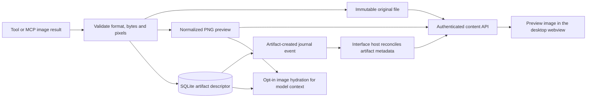

# Image artifact pipeline

[Documentation index](README.md) · [Preview user guide](artifact-preview-plan.md) · [Architecture](architecture.md)

This document maps the delivered implementation. The original A–E roadmap is superseded by the code and verification surfaces below; unchecked historical milestones are not a current task list.

## Data flow



## Modules

| Responsibility | Implementation |
| --- | --- |
| Contracts | [ImageArtifact / ArtifactPage](../packages/protocol/src/index.ts) |
| Validation, content addressing, derivative encoding | [artifacts.ts](../apps/daemon/src/artifacts.ts) |
| Descriptor persistence and idempotent events | [storage](../packages/storage/src/index.ts) |
| Workspace image import and structured tool output | [tools.ts](../apps/daemon/src/tools.ts) |
| MCP image content normalization | [mcp.ts](../apps/daemon/src/mcp.ts) |
| macOS window capture | [window-capture.ts](../apps/daemon/src/window-capture.ts) |
| Images-compatible generation/edit requests | [image-generation.ts](../apps/daemon/src/image-generation.ts) |
| Last-two-image model inputs | [image-inputs.ts](../apps/daemon/src/image-inputs.ts) |
| Authenticated routes | [app.ts](../apps/daemon/src/app.ts) |
| Metadata/content client | [client](../packages/client/src/index.ts) |
| Preview controls and pixel geometry | [live.ts](../apps/graphics/live.ts), [host.ts](../apps/graphics/host.ts) |

## Ingestion and storage

`ImageOutput` contains bytes, declared MIME type, and optional filename/model/revision/viewport metadata. Structured tool results carry text plus images; string-only tools remain supported.

Sharp verifies PNG/JPEG/WebP, rejects animated/mismatched or oversized inputs, applies orientation, and creates a PNG preview up to 1600 pixels on either edge. Ingestion caps each input at 20 MiB/40 million pixels. MCP JSON-RPC image frames are separately bounded at 32 MiB; normal text results remain bounded.

Original and preview files use SHA-256 names under `artifacts/` beside the database. Writes use temporary files and rename, with owner-only permissions. SQLite stores the descriptor and a producer-output idempotency key based on tool-call ID/output index, preventing duplicate journal delivery from creating duplicate artifacts. Original image bytes are not embedded in model-message/event JSON.

Artifacts are session-scoped. The descriptor links to a recorded turn/tool and stores an explicit `revisionOf` only if the referenced artifact exists in that session. This is not arbitrary filesystem serving: client IDs resolve through metadata to the content-addressed files.

## HTTP contract

| Route | Behavior |
| --- | --- |
| `GET /v1/sessions/:id/artifacts?after=N&limit=N` | Cursor page, next cursor and event watermark; limit 1–100, default 50 |
| `GET /v1/sessions/:id/artifacts/:artifactId` | Session-scoped descriptor |
| `GET /v1/sessions/:id/artifacts/:artifactId/content?variant=preview` | PNG derivative; default variant |
| `GET /v1/sessions/:id/artifacts/:artifactId/content?variant=original` | Original bytes and MIME type |
| `POST /v1/sessions/:id/artifacts/import` | Import permitted workspace image; optional reference/viewport metadata |

All routes require production daemon authentication. Content responses include MIME type, length and ETag. Missing files return an unavailable/not-found response. Reference import requires a session with a workspace and existing turn. The [typed client](../packages/client/src/index.ts) is the source for request/response shapes.

## UI state and model input

The interface host fetches authenticated images and supplies safe data to the webview page. Loading an artifact does not expose the daemon token. Request identities prevent stale asynchronous loads from replacing a newer selection.

Selection, pin/follow, zoom, pan, comparison opacity and reference choice are frontend state. Daemon metadata/content survive restart; not every viewing preference is persisted. Pane navigation is remembered within a session, and panel width is saved in `graphics-ui.json`.

Vision hydration selects the last two retained image IDs in tool messages, resolves their previews, and adds data URLs only at the provider boundary. The engine reserves additional context for those image inputs. A missing file does not prevent text-only replay. Chat Completions and Responses serialize image inputs differently through their respective adapters.

## Rendering and packaging

Images are rendered as part of the HTML interface in the [desktop window](desktop.md).

Compiled daemons load native image dependencies beside the real executable, outside Bun's embedded filesystem. Keep `dist/node_modules` with `demesned`; building only the executable and omitting those codecs is incomplete packaging.

## Verification

```sh
bun test apps/daemon/test/artifacts.test.ts apps/daemon/test/image-inputs.test.ts apps/daemon/test/image-generation.test.ts
bun test packages/storage/test apps/graphics/test/panel-api.test.ts
```

Coverage includes immutable originals, MIME/size rejection, authenticated/session-scoped access, duplicate delivery, model hydration, replay, reference import, and the panel API. Tests with fake producers do not establish a live provider's model availability or image-generation entitlement.
