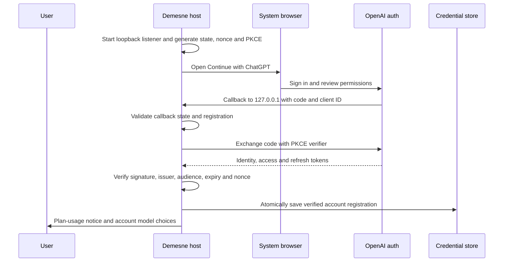

# Authentication and provider access

[Documentation index](README.md) · [Configuration](configuration.md) · [Security](../SECURITY.md)

## Two separate credentials

The CLI/graphics host authenticates to the local daemon with `daemon.token`. Providers have their own credentials. The browser renderer gets neither credential; the privileged host and daemon perform authenticated requests.

## Signing in and out in the app

**Settings › Providers** (or `/providers`, also `/login` and `/logout`) lists every configured provider with its state: ChatGPT, Codex and OpenRouter as signed in or out, local servers as needing no sign-in. Enter on a signed-out account opens its browser sign-in; on a signed-in one it signs out. A provider that isn't set up yet is listed too, and signing in adds it without replacing your primary provider. Signing in to ChatGPT from this list is your acknowledgement that eligible requests count toward your ChatGPT plan, as the row says.

Signing out keeps the provider's configuration so signing back in is one step: ChatGPT's tokens are revoked and deleted (the account stays registered), Codex signs out of Demesne's managed account, and OpenRouter's key is removed from your config. The daemon then reloads its providers without a restart (`POST /v1/providers/reload`); a provider you're signed out of isn't offered. If it served the model you were using, demesne switches to another model, preferring one on your own machines, and says which.

## Continue with ChatGPT

```sh
demesne auth login chatgpt
demesne auth accounts chatgpt
demesne auth status chatgpt
demesne auth login chatgpt --new-account
demesne auth use chatgpt --account ACCOUNT_ID --model MODEL_SLUG
demesne auth login chatgpt --account ACCOUNT_ID --consent
demesne auth logout chatgpt --account ACCOUNT_ID
```

`openai` is accepted as an alias for `chatgpt` by the auth entry point. Model choices come from the signed-in account's catalog. The CLI validates an explicitly selected slug and otherwise selects the first available catalog item. Existing local providers are preserved by standalone login; setup's Review makes the chosen provider primary.



Demesne implements OpenAI's [local-app registration flow](https://developers.openai.com/siwc/token-sharing-open-source/sign-in). It persists a host identifier, uses dynamic registration for a new account, and reuses the issued client ID for a returning registration. A different verified identity cannot silently replace the selected registration. No other application's credential file is read.

The first plan-enabled login shows a usage acknowledgement. Tokens are saved after verified sign-in; the provider configuration is applied when setup Review is confirmed. Cancelling Review does not erase an already completed ChatGPT registration. Add `--no-browser` to open the link manually; the browser callback must still reach the same host's `127.0.0.1`. Non-interactive use can acknowledge the notice with `--accept-plan-usage`.

Credentials live under `<data_dir>/auth/chatgpt.json`, with private directory/file permissions, atomic writes, and a cross-process refresh lock. The config contains `auth = "chatgpt"` plus an `auth_profile` reference. Successful refreshes replace rotating credentials together. Terminal refresh failures require sign-in again. Logout clears local tokens and attempts refresh-token revocation; if remote revocation cannot be confirmed, the CLI says so. Registration identity remains available for later sign-in.

## ChatGPT inference behavior

Demesne uses the public [Responses API route for plan usage](https://developers.openai.com/siwc/token-sharing-open-source/models-and-inference), with `store: false`, `stream: true`, and locally supplied conversation history. Function tools are namespaced. Completed streamed items are retained even when the terminal response's output array is empty; opaque reasoning is reused only with the matching account/model.

A completed stream is required before tools execute. Failed, incomplete, or disconnected streams remain failures. Eligible calls count against ChatGPT plan usage/credits; [Manage usage](https://chatgpt.com/settings/usage). There is no automatic API-key billing fallback.

Under the documented [preview limitations](https://developers.openai.com/siwc/token-sharing-open-source/preview-limitations), `max_output_tokens` is omitted from this route. In Demesne it is a local context reserve, not an enforced server output cap. Supported reasoning levels and summary support are discovered from model metadata; the adapter forwards the selected level and requests summaries only where supported. Image generation remains a separately configured backend.

Implementation: [OAuth package](../packages/chatgpt-auth/src/index.ts), [CLI wiring](../apps/cli/src/chatgpt-auth.ts), [Responses adapter](../packages/providers/src/chatgpt.ts).

## Codex with a ChatGPT account

Choose **Codex · ChatGPT account** under Settings › Providers, or use:

```sh
demesne auth login codex
demesne auth status codex
demesne auth logout codex
# Select this exact model only if the Codex catalog offers it:
demesne auth login codex --model codex/gpt-6.1-sol
```

This provider uses the installed [Codex CLI's App Server](https://learn.chatgpt.com/docs/app-server) over private process pipes. Install the official CLI with `npm install -g @openai/codex` if it is missing, or set `DEMESNE_CODEX_BIN` to its executable. The protocol integration is validated against Codex 0.160.0; an older CLI may need an update to support the dynamic tool bridge. The desktop app does not bundle Codex.

Complete the browser sign-in for Demesne even if you already use Codex or OpenCode elsewhere. The app-server receives its own `CODEX_HOME` at `<data_dir>/codex`; Codex stores and refreshes this account's credentials there. Demesne does not import another application's tokens or use ambient API keys. This provider accepts ChatGPT account sign-in and has no API-key billing fallback. Its sign-out affects Demesne's managed account.

The existing **ChatGPT** provider keeps its public plan-sharing API route. **Codex** discovers models through app-server's `model/list`. These catalogs can differ, and an app-server catalog can use bundled or cached data. A listed model still requires access from the signed-in account. Demesne prefixes Codex IDs with `codex/`, such as `codex/gpt-6.1-sol`, so they can coexist with ChatGPT and OpenRouter IDs. Supported thinking levels come from the Codex catalog. See [OpenAI's catalog guidance](https://developers.openai.com/siwc/token-sharing-open-source/models-and-inference).

Standalone login preserves other providers and prints the selected model. CLI login, CLI logout and Settings sign-in reload providers in the running daemon. Select the connected model with `/model`. If an older running daemon cannot reload, the CLI prints a restart reminder; restart after current work finishes.

Demesne supplies conversation history and registers its own tools with app-server. It executes those tools through the usual workspace, approval and subagent rules. The managed Codex process runs from an isolated directory with native workspace execution and editing disabled; it does not independently run a second coding agent against your repository. Image generation remains a separately configured backend.

Implementation: [managed runtime and sign-in](../packages/codex/src/index.ts), [CLI wiring](../apps/cli/src/codex-auth.ts), [provider bridge](../packages/providers/src/codex.ts). See [architecture](architecture.md#codex-tool-bridge) and [troubleshooting](troubleshooting.md#codex-models-or-sign-in).

## OpenRouter and API keys

`demesne auth login openrouter [--model ID] [--no-browser]` uses a browser/PKCE key flow, or `OPENROUTER_API_KEY` if provided. Standalone login writes a private provider configuration after validating the key/catalog. In setup, the key stays outside rendered state until Review writes it. The authenticated OpenRouter catalog supplies model metadata.

For another OpenAI-compatible endpoint, set its private `api_key` or the primary provider's `DEMESNE_API_KEY`. Model inference goes through Chat Completions. Supported reasoning controls vary by endpoint; an OpenAI-shaped API does not guarantee every optional field behaves identically.

Implementation: [OpenRouter auth](../apps/cli/src/openrouter-auth.ts), [provider adapter](../packages/providers/src/index.ts). See [troubleshooting](troubleshooting.md#chatgpt-sign-in-or-incomplete-tool-calls) for expired sessions and missing plan permissions.
