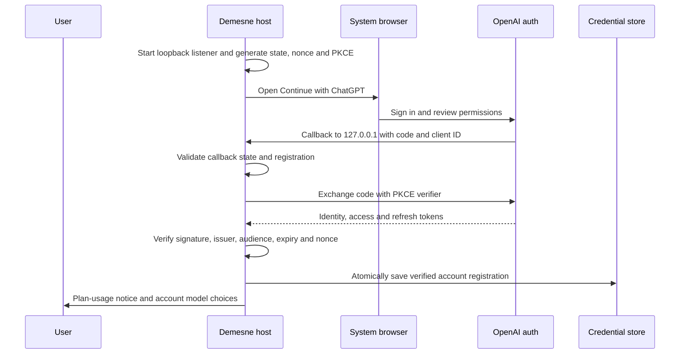

# Authentication and provider access

[Documentation index](README.md) · [Configuration](configuration.md) · [Security](../SECURITY.md)

## Two separate credentials

The CLI and desktop host authenticate to the local daemon with `daemon.token`. Providers have their own credentials. The desktop webview gets neither credential; the privileged host and daemon perform authenticated requests.

## Signing in and out in the app

**Settings › Providers** (or `/providers`, also `/login` and `/logout`) lists every configured provider with its state: ChatGPT and OpenRouter as signed in or out, local servers as needing no sign-in. Enter on a signed-out account opens its browser sign-in; on a signed-in one it signs out. A provider that isn't set up yet is listed too, and signing in adds it without replacing your primary provider. Signing in to ChatGPT from this list is your acknowledgement that eligible requests count toward your ChatGPT plan, as the row says.

Signing out keeps the provider's configuration so signing back in is one step: ChatGPT's tokens are revoked and deleted (the account stays registered), and OpenRouter's key is removed from your config. The daemon then reloads its providers without a restart (`POST /v1/providers/reload`); a provider you're signed out of isn't offered. If it served the model you were using, demesne switches to another model, preferring one on your own machines, and says which.

## Continue with ChatGPT

The **ChatGPT** provider connects directly to OpenAI's public Responses API. It can use `gpt-6.1-sol` with an eligible signed-in account. Demesne owns conversation context, tool execution and approvals; no separate coding-agent runtime is required.

```sh
demesne auth login chatgpt
demesne auth accounts chatgpt
demesne auth status chatgpt
demesne auth login chatgpt --new-account
demesne auth use chatgpt --account ACCOUNT_ID --model MODEL_SLUG
demesne auth login chatgpt --account ACCOUNT_ID --consent
demesne auth logout chatgpt --account ACCOUNT_ID
```

To select Sol directly, sign in once or use an existing Demesne ChatGPT account:

```sh
demesne auth login chatgpt --model gpt-6.1-sol
# With an already signed-in account:
demesne auth use chatgpt --account ACCOUNT_ID --model gpt-6.1-sol
```

`openai` is accepted as an alias for `chatgpt` by the auth entry point. Model choices normally come from the signed-in account's catalog, and the default remains its first available item. If you explicitly request `gpt-6.1-sol` and the catalog omits it, Demesne sends a small text-only verification request with that account. The connection is saved only after a completed response identifies Sol. This uses plan allowance; a denial, failed or incomplete response leaves the provider configuration unchanged. Opening the model list does not run this verification. Other unlisted model IDs remain unavailable.

Existing local providers are preserved by standalone login; setup's Review makes the chosen provider primary. After connecting, select `/model gpt-6.1-sol`. A configured Sol choice remains available when the account's catalog omits it; inference still requires that account's access.



Demesne implements OpenAI's [local-app registration flow](https://developers.openai.com/siwc/token-sharing-open-source/sign-in). It persists a host identifier, uses dynamic registration for a new account, and reuses the issued client ID for a returning registration. A different verified identity cannot silently replace the selected registration. No other application's credential file is read.

The first plan-enabled login shows a usage acknowledgement. Tokens are saved after verified sign-in; the provider configuration is applied when setup Review is confirmed. Cancelling Review does not erase an already completed ChatGPT registration. Add `--no-browser` to open the link manually; the browser callback must still reach the same host's `127.0.0.1`. Non-interactive use can acknowledge the notice with `--accept-plan-usage`.

Credentials live under `<data_dir>/auth/chatgpt.json`, with private directory/file permissions, atomic writes, and a cross-process refresh lock. The config contains `auth = "chatgpt"` plus an `auth_profile` reference. Successful refreshes replace rotating credentials together. Terminal refresh failures require sign-in again. Logout clears local tokens and attempts refresh-token revocation; if remote revocation cannot be confirmed, the CLI says so. Registration identity remains available for later sign-in.

## ChatGPT inference behavior

Demesne uses the public [Responses API route for plan usage](https://developers.openai.com/siwc/token-sharing-open-source/models-and-inference), with `store: false`, `stream: true`, and locally supplied conversation history. OpenAI documents `gpt-6.1-sol` on this direct route. Demesne handles workspace tools and approvals. Function tools are namespaced. Completed streamed items are retained even when the terminal response's output array is empty; opaque reasoning is reused only with the matching account/model.

A completed stream is required before tools execute. Failed, incomplete, or disconnected streams remain failures. Eligible calls count against ChatGPT plan usage/credits; [Manage usage](https://chatgpt.com/settings/usage). There is no automatic API-key billing fallback.

Under the documented [preview limitations](https://developers.openai.com/siwc/token-sharing-open-source/preview-limitations), `max_output_tokens` is omitted from this route. In Demesne it is a local context reserve, not an enforced server output cap. Supported reasoning levels and summary support normally come from model metadata. A verified Sol entry uses its documented context and reasoning levels if the catalog supplies none. The adapter forwards the selected level and requests summaries only where supported. Image generation remains a separately configured backend.

Implementation: [OAuth package](../packages/chatgpt-auth/src/index.ts), [CLI wiring](../apps/cli/src/chatgpt-auth.ts), [Responses adapter](../packages/providers/src/chatgpt.ts).

## Upgrading from the retired Codex provider

The separate Codex runtime provider and its auth commands have been removed. Existing `auth = "codex"` provider sections are ignored when configuration loads. If the primary provider was Codex, the first remaining additional provider becomes primary; without one, Demesne returns to setup. Other provider settings and non-provider configuration are preserved. The next configuration write backs up the original file and removes the retired sections.

Use **ChatGPT** under Settings › Providers or the Sol commands above. An existing Demesne ChatGPT registration can be selected with `auth use`; otherwise complete its browser sign-in. The old managed account is not copied into the direct provider, and the upgrade does not read or delete `<data_dir>/codex`. Saved transcripts remain available; their historical `codex/` model labels do not select a current model.

## OpenRouter and API keys

`demesne auth login openrouter [--model ID] [--no-browser]` uses a browser/PKCE key flow, or `OPENROUTER_API_KEY` if provided. Standalone login writes a private provider configuration after validating the key/catalog. In setup, the key stays outside rendered state until Review writes it. The authenticated OpenRouter catalog supplies model metadata.

For another OpenAI-compatible endpoint, set its private `api_key` or the primary provider's `DEMESNE_API_KEY`. Model inference goes through Chat Completions. Supported reasoning controls vary by endpoint; an OpenAI-shaped API does not guarantee every optional field behaves identically.

Implementation: [OpenRouter auth](../apps/cli/src/openrouter-auth.ts), [provider adapter](../packages/providers/src/index.ts). See [troubleshooting](troubleshooting.md#chatgpt-sign-in-or-incomplete-tool-calls) for expired sessions and missing plan permissions.
