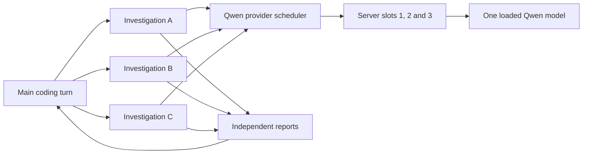

# Subagents and concurrency

[Documentation index](README.md) · [Configuration](configuration.md#multiple-providers-and-concurrency) · [Agent Drive](agent-drive.md)

## What a subagent is

The coding agent calls the `subagent` tool with a task label, a self-contained prompt, and optionally a configured model ID. Each invocation gets a fresh context. The parent receives its final report; the UI separately shows its model, thinking, tool steps and status.

Allowed tools are `list_files`, `read_file`, `read_files`, `search_files`, `git_status`, and `git_diff`. Subagents cannot edit files, run commands, ask the human, or spawn more subagents. They are useful for independent investigations, not parallel code changes. [Implementation](../apps/daemon/src/subagent.ts) · [tests](../apps/daemon/test/subagent.test.ts).

```text
/subagent qwen3.8-27b
Use three Qwen subagents in parallel: trace session restore, inspect permission checks,
and map the test entry points. Have each return file references and a short report.
```

Use a model ID that appears in your installation. `/subagent same` clears the independent default. The setting is saved under `[agent] subagent_model`; the tool's explicit model argument overrides it for that invocation. Main-model selection remains separate.

## Scheduling



Launching three tasks does not load three model copies. With one server/daemon slot, model requests take turns; filesystem reads can overlap. With three matching slots, requests can generate concurrently against one loaded model. Each active sequence needs context/cache capacity, and all share GPU compute and bandwidth.

Schedulers are per provider ID. The main agent, subagents, and Drive reviews using the **same** provider share its capacity; separate providers have separate queues. A parent releases its model slot before executing delegated work. Adding slots only in Demesne cannot create capacity in the model server. [Scheduler](../apps/daemon/src/inference-scheduler.ts) · [model routing](../apps/daemon/src/multi-provider-processor.ts).

## Limits

| Control | Current behavior |
| --- | --- |
| Research rounds | Up to 16 tool-bearing rounds, followed by a final report attempt |
| Tool calls | 48-call allowance checked between rounds; a batch can reach/exceed it before finalization |
| Tools per model response | At most 8 assembled calls |
| Tool result/report clipping | 32 KiB / 16 KiB named limits in the implementation; applied by JavaScript string slicing |
| Output/context budget | Inherits the selected model's configured limits |
| Reasoning | Receives the parent's thinking choice; supported effort depends on its selected provider/model |
| Cancellation | Parent cancellation propagates to the subagent request and tools |

These fixed research bounds are not `[agent] max_model_rounds`/`max_tool_calls`, which govern the parent turn. Per-subagent time, reasoning-token, and round-budget settings are not separate configurable fields today. A model-server reasoning budget is independent of Demesne's total output cap. More concurrent agents do not by themselves cure excessive reasoning or repeated investigation.

## Three-slot Qwen example

This is a tested **local profile**, not a universal preset or a claim that every GPU fits it:

| Setting | Tested value |
| --- | --- |
| Model/server | Qwen3.8-27B UD-Q5_K_XL, llama.cpp build b10919 |
| Model copies / GPU | One loaded model on one R9700 |
| Parallel slots | 3 |
| Context per slot / total | 32,768 / 98,304 tokens |
| Demesne output cap/reserve | 8,192 tokens |
| Server thinking budget | 2,048 tokens for ordinary use |
| Loading mode | `--load-mode none` (buffered loading) |

The relevant sizing flags are `--parallel 3 --ctx-size 98304 --load-mode none --reasoning-budget 2048`. They accompany the already verified model, device, cache, vision and speculation options; they are not a complete portable launch command. Match your installed server's help before applying them. Preserve a working one-slot configuration and replace the existing process rather than loading an extra model copy.

On 2026-10-02, short synthetic tests observed three active slots, about 25.9 GiB peak dedicated GPU memory, and at least 12.9 GiB free host RAM during the three-slot trial. Cached 5,026-token prompts producing 128 tokens each took 7.1 seconds as a three-request batch; a single cached request took 3.4 seconds. The roughly 1.45× throughput comparison uses three times that single-request latency, **not a measured serial three-request batch**. Reasoning was disabled for that throughput measurement. A later integration check ran three read-only file-investigation subagents, six model requests total, with verified reports in about 10 seconds.

The [saved measurement report](measurements/qwen-concurrency-2026-10-02.json) includes the synthetic trials. Its `finalState` records the immediate test cleanup, before the later three-slot rollout; it is not live installation status.

These checks establish short-workload feasibility, not performance at three full 32K contexts, images, or long coding sessions. Initial mmap loading hit the RAM guard; buffered loading completed. Hardware headroom and current applications still matter. The standalone long-context configuration and the three-slot configuration are alternatives on that server, not simultaneous profiles advertised by Demesne.

## Check an installation

```sh
demesne ps --json
demesne models
```

Confirm `providerInferenceSlots` matches the provider/server. Inspect the model server's slot/context metadata separately. When a worker looks slow, distinguish queued time, initial prompt processing, generation, and repeated tool rounds before increasing concurrency. See [troubleshooting](troubleshooting.md#qwen-thinking-for-too-long-or-subagents-waiting).
