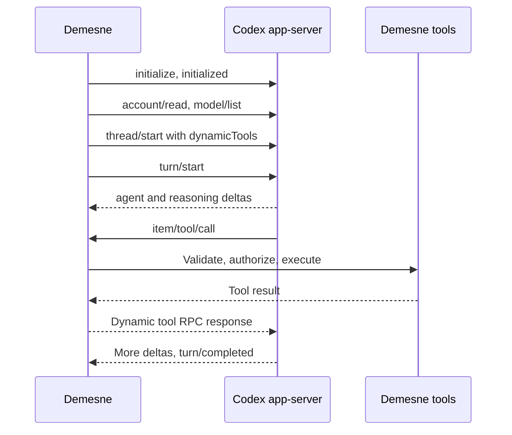

# Codex runtime

Demesne uses the installed [Codex app-server](https://learn.chatgpt.com/docs/app-server) through newline-delimited JSON over stdio. The package implements process ownership, initialization, request correlation, cancellation, frame limits, account sign-in, and model discovery. The protocol was verified against Codex CLI **0.160.0**.

`CodexAuth(dataDir)` creates a separate credential home at `<dataDir>/codex`. Browser sign-in is managed by Codex, including token refresh. Demesne never copies credentials from Codex, OpenCode, or the public ChatGPT provider. An absent executable produces an installation message; `DEMESNE_CODEX_BIN` can select an executable explicitly.

```ts
const auth = new CodexAuth(dataDir);
try {
  const login = await auth.beginLogin({ signal });
  openBrowser(login.url);
  await login.complete;
  const models = await auth.listModels(signal);
  const selected = defaultModel(models);
} finally {
  await auth.close();
}
```

The model catalog and reasoning efforts come from `model/list`. `defaultModel` prefers the exact `gpt-6.1-sol` slug when listed, then the upstream default. This catalog can include bundled entries; a listing does not prove that a particular account can run that model. Authentication status is checked separately, and inference errors remain visible to the user.

The [provider bridge](../providers/src/codex.ts) registers Demesne's tools as experimental dynamic tools. It pauses an app-server turn at `item/tool/call`, lets Demesne execute its existing permission and validation flow, and then answers that same RPC with the result. Built-in workspace tools, external instruction discovery, plugins, integrations, and external notification commands are disabled. Before launching, Demesne checks its owned configuration for custom OpenAI routes or credentials, then pins the built-in provider and official ChatGPT backend. This also protects the catalog refresh that Codex starts before initialization. Startup checks the effective configuration and rejects managed MCP servers or workspace tools that cannot be disabled. Unsupported server requests are rejected instead of being approved.



Run the isolated transport/auth tests with `bun test packages/codex/test`. Tests do not sign in, contact a model, or read a user's existing credential stores.
